# ***Game Ai Là Triệu Phú***

####1. Yêu cầu bài toán: (Sử dụng cơ sở dữ liệu là **`postgresql`**)

* Mỗi câu hỏi có 4 đáp án và chỉ có 1 đáp án đúng. Giới hạn độ dài câu hỏi là 150 ký tự, độ dài đáp án là 50 ký tự.
* Có vấn đề mới phát sinh là có phân loại câu hỏi theo 3 mức: ** Dễ, Trung bình,Khó **.
* Lưu được thông tin cấu hình cho game: Số tiền đạt được ứng với số câu hỏi trả lời được (Ví dụ: trả lời được 1 câu được 500k, 2 câu được 800k, …).
* Giả lập trợ giúp người chơi (50-50, trợ giúp từ khán giả, gọi điện cho người thân).
* Lưu thông tin người chơi bao gồm: Họ tên, Thời điểm chơi, Số tiền đạt được.
* Quản lý game cần thực hiện các chức năng quản lý
####2. Ý tưởng:
* Tạo 2 bảng cơ sở dữ liệu. Bảng 1 là bảng `questions` gồm các thuộc tính như sau: **idQuestion**, **question**, **ask1**, **ask2**,**ask3**, **ask4**,**result**, **idLevel**  Và bảng 2 là bảng `levels` gồm có.**namelevel**,**idlevel**
* Mối quan hệ giữa 2 bảng là : `questions` và `levels` là mối quan hệ 1 nhiều thông qua khóa ngoại **idLevel**
####3. Các câu lệnh tạo bảng:
##### Các thành phần của bảng.

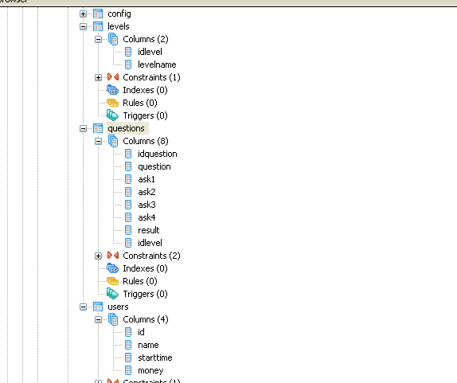


##### Tạo bảng Questions(Theo yêu cầu bài toán thì levels được thêm sau)
```
create table Questions(
idQuestion serial not null,
question character varying(150) not null,
ask1 character varying(50) not null,
ask2 character varying(50) not null,
ask3 character varying(50) not null,
ask4 character varying(50) not null,
state character varying(50) not null,
--idLevel integer not null,
constraint questions_pkey primary key (idQuestion),
constraint question unique (question)
--constraint question_level_fkey foreign key (idLevel)
--references Levels(idLevel)
);
```
**Database questions**
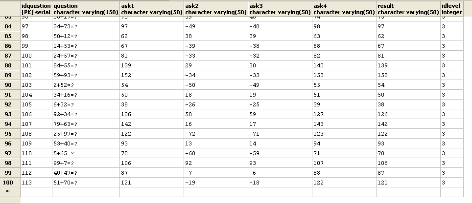
---------------------------------------
##### Tạo bảo levels
```
create table Levels(
idLevel serial not null,
levelName character varying(10) not null,
constraint idLevel_pkey primary key (idLevel)
);
```

**Database level**
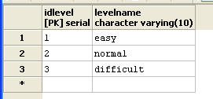
####4. Các câu lệnh truy vấn giải quyết bài toán:
* **1.1 Câu lệnh insert 100 câu hỏi(chưa có level) viết hàm xử lý**
```
CREATE OR REPLACE
FUNCTION auto_add_question(quantity integer)
RETURNs void AS
$BODY$
declare 
	i int;  x int; y int;
BEGIN for i IN 1..$1 LOOP
	x = round(random()*100);
	y = round(random()*100);
INSERT INTO questions(question,ask1,ask2,ask3,ask4,result) values
	(CONCAT(x,'+',y,'=?'),x+y,x-y,x-y+1,x+y+1,x+y);
--INSERT INTO questions(question,ask1,ask2,ask3,ask4,result,idLevel) values
--  (CONCAT(x,'+',y,'=?'),x+y,x-y,x-y+1,x+y+1,x+y,1);
--  (CONCAT(x,'+',y,'=?'),x+y,x-y,x-y+1,x+y+1,x+y,2);
--  (CONCAT(x,'+',y,'=?'),x+y,x-y,x-y+1,x+y+1,x+y,3);
END LOOP;
END;
$BODY$
LANGUAGE plpgsql;


select auto_add_question(100);

```
* **1.2 Truy vấn 1 câu hỏi bất kỳ và lấy ra được nội dung câu hỏi, 4 đáp án, đáp án đúng:**

```
select q.question, q.ask1, q.ask2,q.ask3,q.ask4, q.result from questions q offset random()*100 limit 1;
```
**Database random **
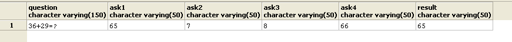

* ** 1.3Truy vấn 1 câu hỏi bất kỳ và lấy ra được nội dung câu hỏi, 4 đáp án,đáp án đúng với dữ liệu với nội dữ liệu không trùng nhau (Sử dụng JSON):**

```
select row_to_json(row) from (select * from questions order by random()*100 limit 1) row;
```
**Database json **
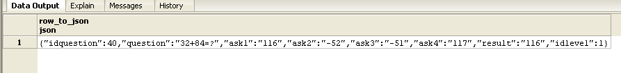

* **2.1 Hãy cập nhật thông tin bảng với yêu cầu mới thêm (Các bảng trước đó đã có và có dữ liệu):**

```
ALTER TABLE questions ADD COLUMN idLevel integer,
ADD CONSTRAINT question_levels_fkey FOREIGN KEY (idLevel) REFERENCES Levels(idLevel);
```
* **2.2 Truy vấn số lượng câu hỏi theo mỗi mức độ khó để kiểm tra số lượng câu hỏi cho mỗi mức độ khó đã bằng nhau chưa:**

```
select l.levelname, count(q.idLevel) as dem
from levels as l  right join
questions as q on l.idLevel=q.idLevel
group by l.levelname;
```
**Database Show count level **
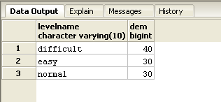
* **2.3 Truy vấn lấy ngẫu nhiên được 1 câu hỏi thuộc mức độ Dễ (Trung bình, Khó):**

```
select q.question,l.levelname 
from questions q left join levels as l on l.idLevel=q.idLevel 
offset random()*100 limit 1;
```
**Database random question level **
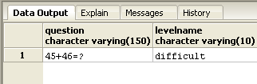

* **2.4 Truy vấn lấy ra ngẫu nhiên 15 câu hỏi và sắp xếp theo thứ tự độ khó tăng dần (mỗi độ khó có 5 câu hỏi sử dụng UNION):**

```
(select question,idlevel from questions where idlevel = 1  ORDER BY random() LIMIT 5)
UNION ALL
(select question,idlevel from questions where idlevel = 2  ORDER BY random() LIMIT 5 )
UNION ALL
(select question ,idlevel from questions where idlevel = 3  ORDER BY random() LIMIT 5);
```
**Database union **
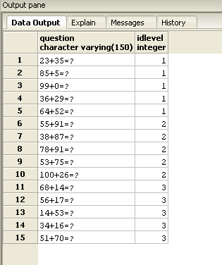
* **3.1 Nhập dữ liệu cấu hình cho game (15 mốc câu hỏi như Ai là triệu phú) (tạo bảng điểm)**

```
CREATE TABLE config(
    id SERIAL NOT NULL ,
    money INTEGER NOT NULL ,
    CONSTRAINT config_pkey PRIMARY KEY (id)
    );

--insert du lieu
    INSERT INTO config(money) VALUES (200000);
    INSERT INTO config(money) VALUES (400000);
    INSERT INTO config(money) VALUES (600000);
    INSERT INTO config(money) VALUES (1000000);
    INSERT INTO config(money) VALUES (2000000);
    INSERT INTO config(money) VALUES (3000000);
    INSERT INTO config(money) VALUES (6000000);
    INSERT INTO config(money) VALUES (10000000);
    INSERT INTO config(money) VALUES (14000000);
    INSERT INTO config(money) VALUES (22000000);
    INSERT INTO config(money) VALUES (30000000);
    INSERT INTO config(money) VALUES (40000000);
    INSERT INTO config(money) VALUES (60000000);
    INSERT INTO config(money) VALUES (85000000);
    INSERT INTO config(money) VALUES (150000000);
....

```
* **4.1 Truy vấn lấy được ngẫu nhiên 2 trong số 4 đáp án của 1 câu hỏi bất kỳ, trong đó bắt buộc phải chứa đáp án đúng:):**

```
CREATE OR REPLACE FUNCTION bo_di_2_phuong_an_sai(id INTEGER)
   RETURNS TABLE(
	name CHARACTER VARYING(150),
	t CHARACTER VARYING(50),
	f CHARACTER VARYING(50)
   ) AS $$    
DECLARE 
     rand INTEGER;
BEGIN
    rand = round(random() * 10);
     rand = rand % 3;
    CASE 
      WHEN rand = 0 THEN RETURN QUERY SELECT questions.question,ask1,ask2 FROM questions WHERE questions.idquestion = $1;
      WHEN rand = 1 THEN RETURN QUERY SELECT questions.question,ask1,ask3 FROM questions WHERE questions.idquestion = $1;
      ELSE RETURN QUERY SELECT questions.question,ask1,ask4 FROM questions WHERE questions.idquestion = $1;
    END CASE;
END 
  $$
LANGUAGE plpgsql;
 
SELECT bo_di_2_phuong_an_sai(100);
```

* **4.2 Truy vấn ngẫu nhiên tỉ lệ khán giả chọn đáp án của 1 câu hỏi theo % (Ví dụ: Đáp án A – 20%, B – 30%, C – 40%, D – 10%): **

```
--ham tao randoms
 CREATE OR REPLACE FUNCTION randoms(numeric, numeric)
   RETURNS numeric AS
   $$
    SELECT ($1 + ($2 - $1) * random())::numeric;
 $$ LANGUAGE 'sql' VOLATILE;


--4.2 Hoi y kien khan gia
CREATE OR REPLACE FUNCTION hoi_y_kien_khan_gia()
   RETURNS TABLE(
       A INTEGER,
       B INTEGER,
       C INTEGER,
       D INTEGER
   ) AS $$
 DECLARE 
     d INTEGER;
     a INTEGER;
     b INTEGER;
     c INTEGER;
 BEGIN
   d = 100;
   a = round(randoms(0,d));
   d = d - a;
   b = round(randoms(0,d));
   d = d - b;
   c = round(randoms(0,d));
   d = d - c;
   RETURN QUERY
     SELECT A,B,C,D;
 END
 $$
   LANGUAGE plpgsql;
 SELECT hoi_y_kien_khan_gia();

```

**Database hỏi khán giả **
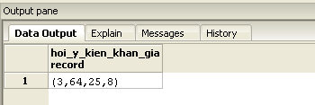
* **4.3 Truy vấn ngẫu nhiên đáp án cho 1 câu hỏi: 5đ (Câu hỏi gọi trợ giúp người thân) **

```
CREATE OR REPLACE FUNCTION goi_dien_thoai_cho_nguoi_than(id INTEGER)
    returns TABLE(res CHARACTER VARYING(50)) AS $$
    DECLARE 
    rand INTEGER;
    BEGIN 
        rand = round(randoms(1,4));
        CASE
            WHEN rand = 1 THEN RETURN QUERY SELECT questions.ask1 FROM questions WHERE questions.idquestion= $1;
            WHEN rand = 2 THEN RETURN QUERY SELECT questions.ask2 FROM questions WHERE questions.idquestion= $1;
            WHEN rand = 3 THEN RETURN QUERY SELECT questions.ask3 FROM questions WHERE questions.idquestion= $1;
            ELSE RETURN QUERY SELECT questions.ask4 FROM questions WHERE questions.idquestion = $1;
        END CASE ;
    END 
    $$
    LANGUAGE plpgsql;

    SELECT goi_dien_thoai_cho_nguoi_than(54);
```
**Database gọi điện người thân **
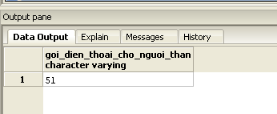

* **5.1 Nhập dữ liệu mẫu 100 người chơi:**

```
CREATE TABLE users(
        id SERIAL NOT NULL ,
        name CHARACTER VARYING(50) NOT NULL ,
        starttime TIMESTAMP NOT NULL ,
        money INTEGER NOT NULL,
        CONSTRAINT users_pkey PRIMARY KEY (id)
    )
--tạo dữ liệu 100 người chơi
CREATE OR REPLACE FUNCTION adduser()
        RETURNS void AS $$
        DECLARE 
        ho CHARACTER VARYING(17);
        dem CHARACTER VARYING(17);
        ten CHARACTER VARYING(17);
        rand INTEGER;
    BEGIN 
    FOR i IN 1..5
        LOOP 
            CASE 
            WHEN i = 1 THEN ho = 'Nguyen';
            WHEN i = 2 THEN ho = 'Le';
            WHEN i = 3 THEN ho = 'Dang';
            WHEN i = 4 THEN ho = 'Dinh';
            ELSE ho = 'Tran';
            END CASE ;
    FOR j IN 1..5
        LOOP
            CASE
            WHEN j = 1 THEN dem = 'Dang';
            WHEN j = 2 THEN dem = 'Van';
            WHEN j = 3 THEN dem = 'Thi';
            WHEN j = 4 THEN dem = 'Cong';
            ELSE dem = 'Hoang';
            END CASE ;
    FOR k IN 1..4
        LOOP
            CASE
            WHEN k = 1 THEN ten = 'Trung';
            WHEN k = 2 THEN ten = 'Cong';
            WHEN k = 3 THEN ten = 'Khiem';
            ELSE ten = 'Nam';
            END CASE ;
            rand = round(randoms(1,15));
            INSERT INTO users(name,starttime,money) VALUES (concat(ho,' ',dem,' ',ten),now(),(SELECT money FROM config WHERE id = rand));
            END LOOP ;
        END LOOP ;
    END LOOP ;
    END 

    $$
    LANGUAGE plpgsql;

    SELECT adduser();
```

**Database user **
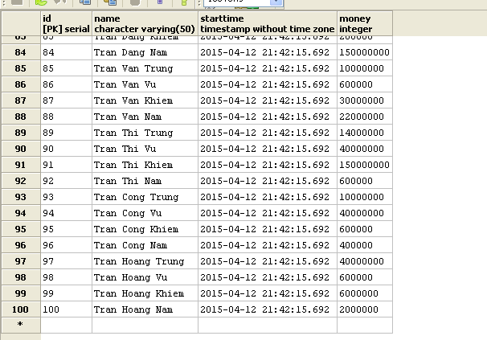
* **5.2 Truy vấn lấy ra 10 người chơi đạt điểm cao nhất, sắp xếp theo thứ tựđiểm cao giảm dần (nếu 2 người chơi có cùng điểm số thì người chơi sau sẽ được xếp ở vị trí cao hơn):**

```
select * from config order by money desc limit 10;
```
**Database money top **
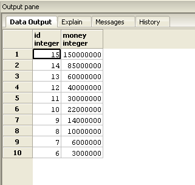
* **6.1 Tìm kiếm câu hỏi theo id, theo từ khóa trong câu hỏi, theo từ khóa trong câu trả lời:**

```

    CREATE OR REPLACE FUNCTION searchquestionss(n CHARACTER VARYING(50))
        RETURNS TABLE(
        
  question CHARACTER VARYING(150),
        ask1 CHARACTER VARYING(50),
        ask2 CHARACTER VARYING(50),
        ask3 CHARACTER VARYING(50),
        ask4 CHARACTER VARYING(50)
        ) AS $$
            DECLARE
        ch CHARACTER VARYING(50);
        BEGIN
        ch = concat('%',$1,'%');
        return QUERY 
        SELECT questions.question,questions.ask1,questions.ask2,questions.ask3,questions.ask4
        FROM questions 
        WHERE 
            questions.question LIKE ch
           OR questions.ask1 LIKE ch
           OR questions.ask2 LIKE ch
           OR questions.ask3 LIKE ch
           OR questions.ask4 LIKE ch;
    END 

    $$
    LANGUAGE plpgsql;

    SELECT searchquestionss('1');
```
**Database search question **
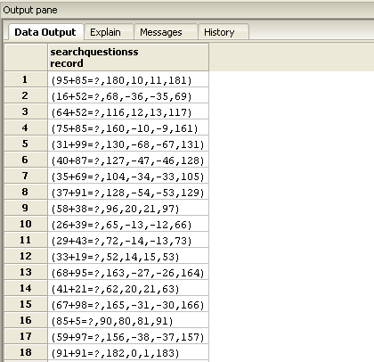

                                   
** Một số ý có tham khảo các team trong lớp đặc biệt bạn `Lâm Đức Trung`**